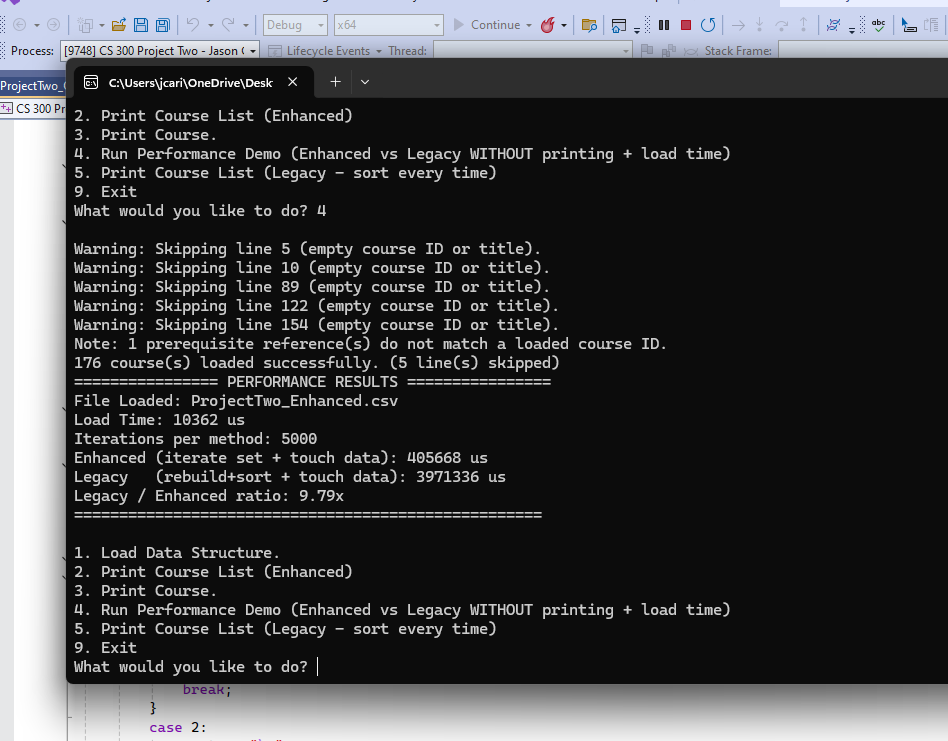
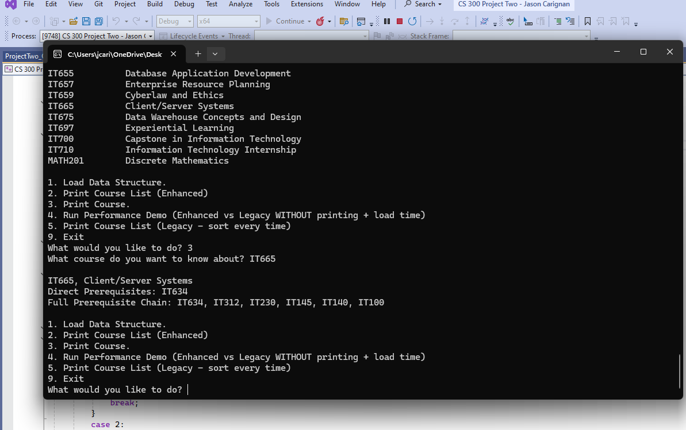

# Algorithms & Data Structures
[Home](https://jasoncarignansnhu.github.io/)

## Artifact Two: Course Planner Application

[See the original and enhanced versions here](https://github.com/jasoncarignanSNHU/jasoncarignanSNHU.github.io/tree/ePortfolio/ArtifactTwo)

Contents include:
- `ArtifactTwo_Original.zip` (CS 300 implementation)
- `ArtifactTwo_Enhanced.zip` (Graph-based + optimized implementation)
- Supporting screenshots

---

### Artifact Overview

The artifact selected for this enhancement is a Course Planner application originally developed in CS 300: Data Structures and Algorithms. The original console-based tool loaded course records from a CSV file, stored them in a hash table, and allowed users to print either a full course list or a single course with its direct prerequisites. While the implementation satisfied the requirements of the course, it relied on sorting the entire course list each time it was printed and did not support advanced prerequisite analysis such as full dependency chains or cycle detection.

For CS 499, this artifact was selected because it provided a clear opportunity to demonstrate algorithmic improvement, measurable performance gains, and more realistic functionality through graph-based modeling. At a high level, the enhancement improves the system in three important ways: it eliminates unnecessary repeated computation, expands prerequisite reasoning using graph traversal, and strengthens its defensive safeguards to prevent unstable execution.

To meaningfully demonstrate performance differences, the dataset was expanded significantly beyond the small file used in CS 300. The updated `ProjectTwo_Enhanced.csv` included a larger set of courses and prerequisite relationships, allowing performance improvements to be measured under more realistic data volumes.

---

### Performance Optimization Through Data Structure Selection

The first major enhancement eliminates repeated sorting by maintaining an always-sorted index of course IDs using `std::set`. In the original design, printing the schedule required rebuilding and sorting a list of IDs each time the option was selected. By maintaining sorted order during insertion, this repeated work was removed entirely.

This design intentionally trades a small amount of additional memory and insertion overhead during load time for significantly improved runtime during repeated schedule printing operations. Because schedule printing is a common user action, this trade-off improves real-world usability while preserving fast lookup through `unordered_map`.

During benchmarking, console output was removed because it masked algorithmic differences. Instead, both the legacy and enhanced paths performed equivalent internal work so that timing results reflected structural improvements rather than display times. With the expanded dataset and repeated schedule operations, the enhanced implementation completed the workload approximately **9.5 times faster** on average than the original version.

This measurable improvement demonstrates the impact of deliberate data structure selection and performance-aware design.

---

### Graph-Based Prerequisite Modeling

The second major enhancement introduces a prerequisite graph represented as an adjacency list. Each course maps to its direct prerequisites, enabling evaluation through graph traversal rather than simply printing immediate dependencies.

A depth-first search (DFS) algorithm expands full prerequisite chains, and memoization is used to cache results so repeated expansions do not recompute the same paths. This improvement allows the system to display the entire sequence of required courses, which better reflects how real advising systems operate.

The DFS implementation also includes recursion stack tracking to detect circular dependencies. If the dataset contains a prerequisite cycle, the program reports an error rather than recursing indefinitely. This safeguards against unstable execution caused by malformed prerequisite data.

One challenge during implementation was preventing the program from repeatedly recalculating the same prerequisite chains. Early testing showed that longer sequences were being evaluated more than once. By storing and reusing previously calculated results, the program became more efficient and avoided unnecessary repeated work.

The screenshot above demonstrates the enhanced menu workflow, including schedule output and expanded prerequisite chains.

---

### Alignment With Program Outcomes

This enhancement demonstrates measurable progress toward the Computer Science program outcomes:

1. **Outcome 1: Employ strategies for building collaborative environments that enable diverse audiences to support organizational decision making.**  
   The separation between parsing, storage, graph construction, benchmarking, and reporting promotes modularity and maintainability, supporting collaborative development and review.

2. **Outcome 2: Design, develop, and deliver professional-quality communications adapted to specific audiences and contexts.**  
   Clear code organization, documented design trade-offs, and measurable benchmarking results communicate technical decisions effectively to both technical and nontechnical stakeholders.

3. **Outcome 3: Design and evaluate computing solutions using algorithmic principles and computer science practices.**  
   The use of hash-based storage, ordered indexing, DFS traversal, memoization, and cycle detection reflects deliberate algorithm selection and evaluation of trade-offs between runtime efficiency and memory usage.

4. **Outcome 4: Use well-founded and innovative techniques, skills, and tools to implement computing solutions that deliver value.**  
   Lightweight benchmarking using C++ timing utilities, structured parsing, and layered data structures demonstrate professional development practices aligned with industry expectations.

5. **Outcome 5: Develop a security mindset that anticipates vulnerabilities and mitigates risks.**  
   Input normalization, duplicate prevention, invalid row rejection, and cycle detection strengthen resilience and protect against malformed or unstable input data.

---

### Reflection

Enhancing this artifact required balancing efficiency, realism, memory usage, and maintainability. The decision to retain `unordered_map` for constant-time lookup while layering `std::set` for ordered iteration reflects thoughtful trade-off management. Expanding the system into a graph-based model increased algorithmic complexity while preserving the original user experience. Implementing and benchmarking these improvements reinforced the importance of evaluating trade-offs between performance, memory usage, and maintainability in real-world systems.

Overall, this enhancement strengthened the artifact by making it more scalable, more efficient under repeated use, and more resilient to imperfect input data. It demonstrates measurable performance improvement, expanded algorithmic depth, and disciplined evaluation of design trade-offs consistent with professional software engineering standards.
