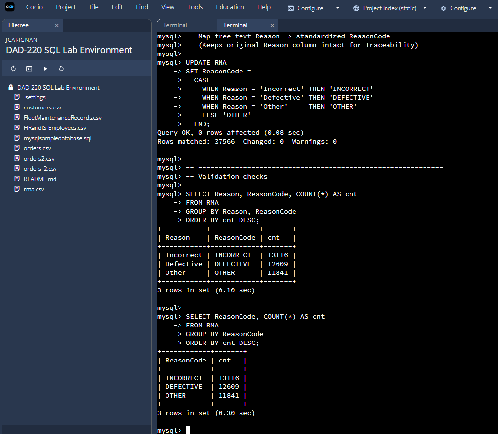
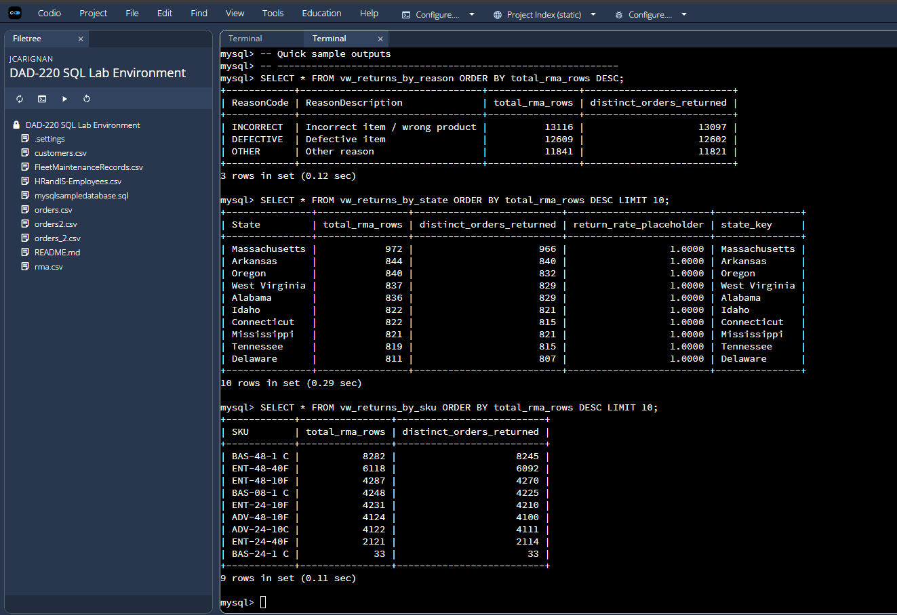
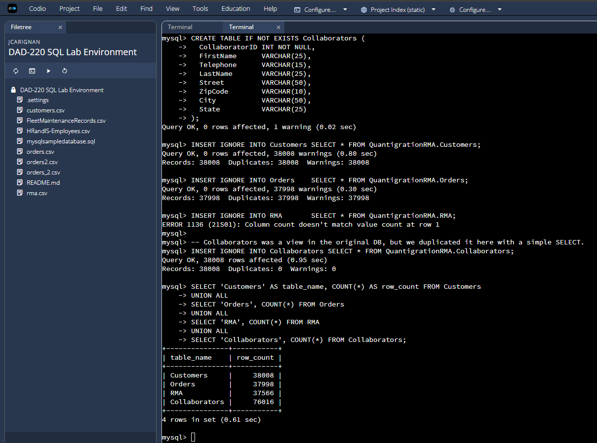
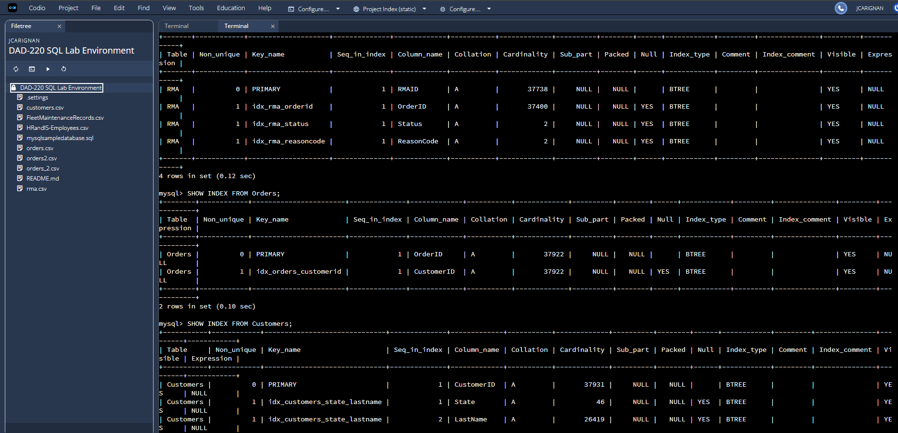
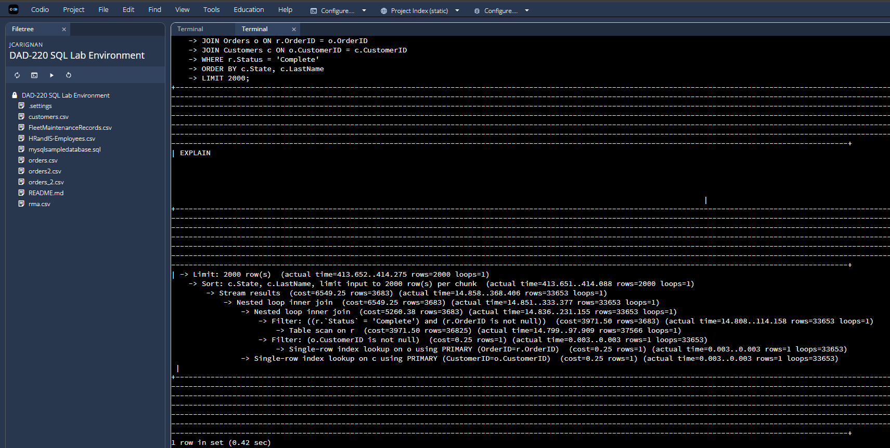
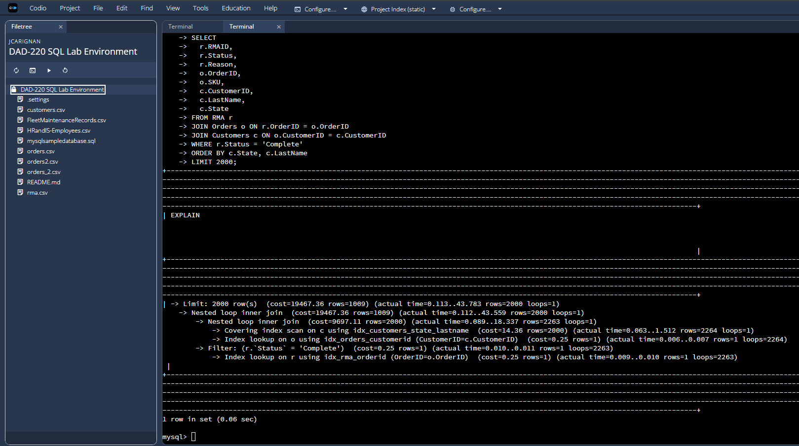

# Databases  
[Home](https://jasoncarignansnhu.github.io/)

## Artifact Three: RMA Analytics Database Enhancement

[See the enhanced database scripts and screenshots here](https://github.com/jasoncarignanSNHU/jasoncarignanSNHU.github.io/tree/ePortfolio/ArtifactThree)

Contents include:
- Enhanced SQL scripts
- Reporting views
- Index definitions
- Performance comparison screenshots
- Supporting documentation  
*(Note: The original implementation was developed in a Codio lab environment and is not available as a downloadable archive.)*

---

## Artifact Overview

The artifact selected for the Databases category is a Return Merchandise Authorization (RMA) analysis database originally created in **DAD 220: Introduction to Structured Databases**. The original project used relational tables including `Customers`, `Orders`, and `RMA` to analyze product returns by state, product, and reason. While the original design supported ad-hoc queries, it relied on raw transactional data and did not scale well for analytics-heavy workloads.

For CS 499, the system was migrated into a new database named `QuantigrationRMA_Enhanced`. The original schema and data were preserved and then extended to support stronger data integrity, analytics-ready reporting, and measurable performance optimization.

At a high level, the enhancement improves the database in four important ways:

- Cleans and standardizes inconsistent data  
- Prevents inflated return metrics through deduplication logic  
- Introduces reusable reporting views  
- Dramatically improves query performance through indexing  

These changes transform the system from a classroom transactional database into a scalable decision-support platform.

---

## Data Quality and Standardization

One of the first enhancements addressed data consistency. In the original implementation, return reasons were stored as free-text values. While this functioned for small queries, inconsistent spelling or categorization can distort reporting in larger systems.

The enhanced version standardizes return reasons into controlled categories, improving aggregation reliability and preparing the data for analytics and dashboard consumption.

This reflects production database practices where consistent categorization is essential for trustworthy reporting.

---

## Deduplication Logic and Accurate Metrics

Another key enhancement was implementing deduplication logic to ensure return counts are based on distinct `OrderID` values rather than raw RMA rows. In real-world systems, duplicate entries can inflate metrics and mislead decision makers.

By counting distinct orders, the enhanced database produces more accurate return rates and protects reporting workflows from distorted data.

This improvement shifts the database from simply storing records to actively enforcing analytical correctness.

---

## Analytics-Ready Reporting Views

The enhanced system introduces reusable SQL views that encapsulate complex joins and business logic into stable reporting layers. Instead of requiring analysts to repeatedly write multi-table joins, the views provide clean, analytics-ready datasets.

This mirrors how enterprise databases support dashboards in tools such as Power BI or Tableau. By abstracting complexity into views, the system becomes easier to use, more consistent across teams, and safer for downstream analytics.

For analysts and managers, this means faster access to reliable metrics without needing to understand the underlying join logic.

---

## Schema and Structural Improvements

The database structure was preserved but extended to support improved normalization and indexing strategies. The enhanced schema supports scalable joins and structured reporting workflows.

These refinements reflect the transition from a classroom assignment to a system designed for enterprise-scale analytics.

---

## Performance Optimization Through Indexing

The most measurable enhancement was performance optimization through strategic indexing.

Indexes were added to support:

- Filtering by RMA status  
- Joining RMA to Orders  
- Joining Orders to Customers  
- Sorting by customer location  

To quantify the improvement, the same analytical query was executed against both the original and enhanced databases using `EXPLAIN ANALYZE`. The query retrieves completed RMAs joined to Orders and Customers and sorts by customer location.

In the original database, the query required a full table scan and large sort operation across more than 33,000 rows, resulting in execution times exceeding 400 milliseconds.

After indexing and query optimization, the enhanced database used indexed joins and covering indexes to eliminate unnecessary scans and sorts. Execution time dropped to approximately 40 milliseconds — nearly ten times faster.

While this improvement is visible at 37,000 rows, the real impact becomes critical at scale. In enterprise systems containing millions or billions of rows, unindexed scans can make dashboards unusable. Proper indexing enables near-real-time reporting, interactive analytics, and scalable data pipelines.

For end users such as analysts or managers, this translates directly into faster dashboards, more responsive reporting tools, and the ability to make timely data-driven decisions.

---

## Alignment With Program Outcomes

This enhancement demonstrates measurable progress toward the Computer Science program outcomes:

1. **Outcome 1: Employ strategies for building collaborative environments that enable diverse audiences to support organizational decision making.**  
   Reusable reporting views and standardized data structures ensure analysts, developers, and decision makers operate from consistent datasets.

2. **Outcome 2: Design, develop, and deliver professional-quality communications adapted to specific audiences and contexts.**  
   Clear schema organization, structured views, and performance comparisons communicate design decisions effectively to both technical and nontechnical stakeholders.

3. **Outcome 3: Design and evaluate computing solutions using algorithmic principles and computer science practices.**  
   Deduplication logic, optimized joins, and query evaluation demonstrate thoughtful assessment of correctness and efficiency trade-offs.

4. **Outcome 4: Use well-founded and innovative techniques, skills, and tools to implement computing solutions that deliver value.**  
   Strategic indexing, query plan analysis, and reusable reporting layers reflect industry-standard database engineering practices.

5. **Outcome 5: Develop a security mindset that anticipates vulnerabilities and mitigates risks.**  
   Data normalization, duplicate prevention, and structured validation reduce the risk of corrupted analytics and protect the integrity of decision-making processes.

---

## Reflection

This enhancement shifted my perspective from writing isolated SQL queries to engineering a scalable data platform. I learned how data quality issues directly influence business decisions and how indexing and query planning determine whether a database can scale from thousands of rows to enterprise-grade volumes.

The most significant takeaway was seeing how small structural improvements — controlled vocabularies, distinct-count logic, composite indexes, and reusable views — can produce dramatic gains in both reliability and performance.

This artifact demonstrates not only technical database skills, but also the ability to design systems that support real-world analytics, collaboration, and data-driven decision making at scale.
